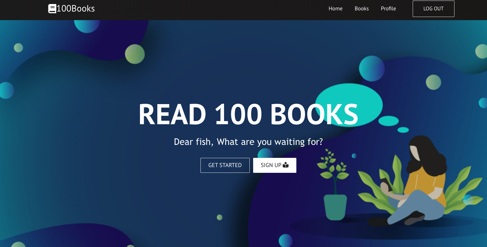
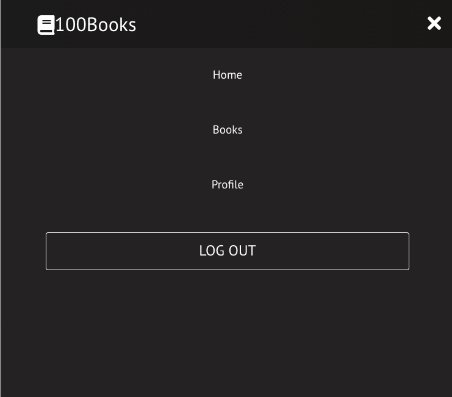
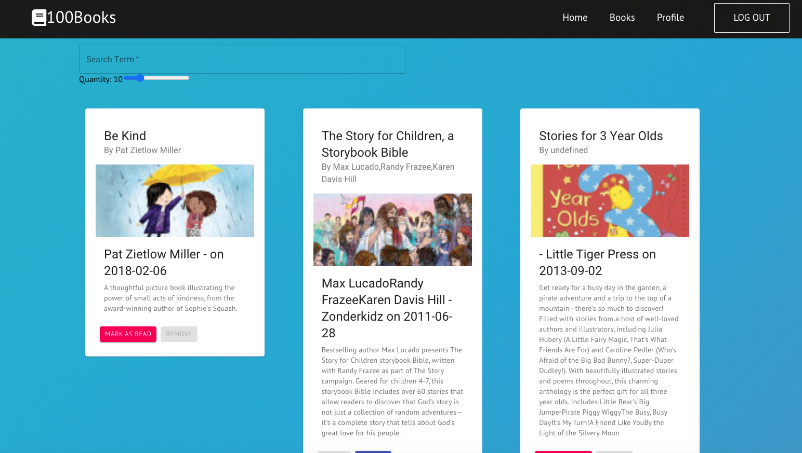
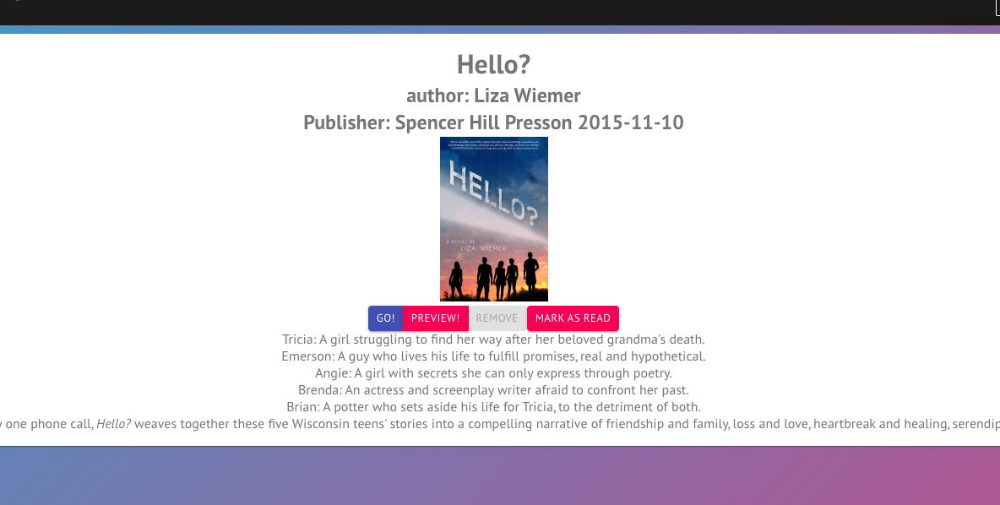
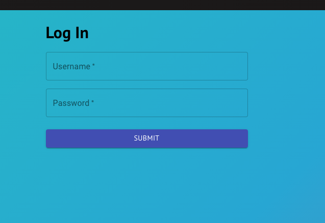
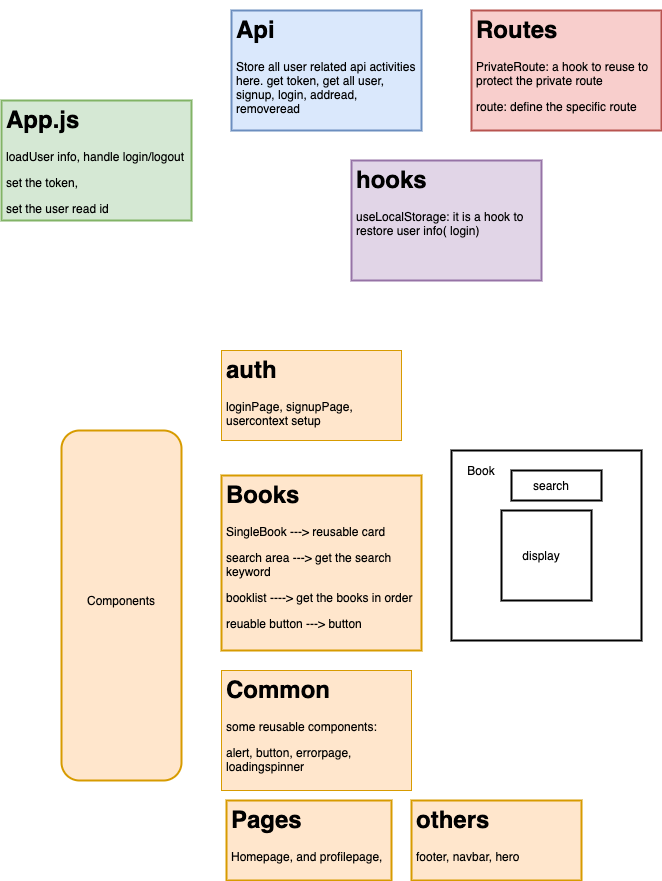

# 100-Books

## Description

It is a simple book app which can search and save books for user. It create a 100 books challenge.

## Deployment

### frontend

This Project is deployed at:

Open https://wizardly-gates-f59e18.netlify.app/

Using surge to deploy the frontend

### backend

It use heroku to deploy the backend.
The backend is available at:

https://github.com/dengxinjuan/100-books-backend

Deployed backend at:

https://books100backend.herokuapp.com/

## Preview

## Design

## Functions

- User Login & Registration screens
- Navigation (Drawer or Tab Bar)
- Books Lists
- Books Details screen (including author, description, book cover photo, maybe price, etc)
- Book Search functionality
- Bookmarks for Current reading books (Book Shelf)
- Progress Bar for 100 Books (Already Read Books)
- User edit their profile
- After completed , winner page (tbd)

## Tech

- React
- React-router-dom
- Node
- Material UI
- Axios
- UseContext
- addiontional: font-awesome, jest

### API

Google Books API

https://developers.google.com/books/docs/v1/getting_started

## User

It is created for reader who want to read books with a goal.

## UI

- Color: black, blue, turquiose, puprle (gardient)
- Style: causual

## Available Scripts

In the project directory, you can run:

### `npm start`

Runs the app in the development mode.\
Open [http://localhost:3001](http://localhost:3001) to view it in the browser.

The page will reload if you make edits.\
You will also see any lint errors in the console.

### `npm test`

Launches the test runner in the interactive watch mode.\
See the section about [running tests](https://facebook.github.io/create-react-app/docs/running-tests) for more information.

## Front-end Logic

- Books->Booklist->Bookcard(SingleBook)
- BookApi -> App -> login/logout/add/remove

## Learn More

You can learn more in the [Create React App documentation](https://facebook.github.io/create-react-app/docs/getting-started).

To learn React, check out the [React documentation](https://reactjs.org/).
